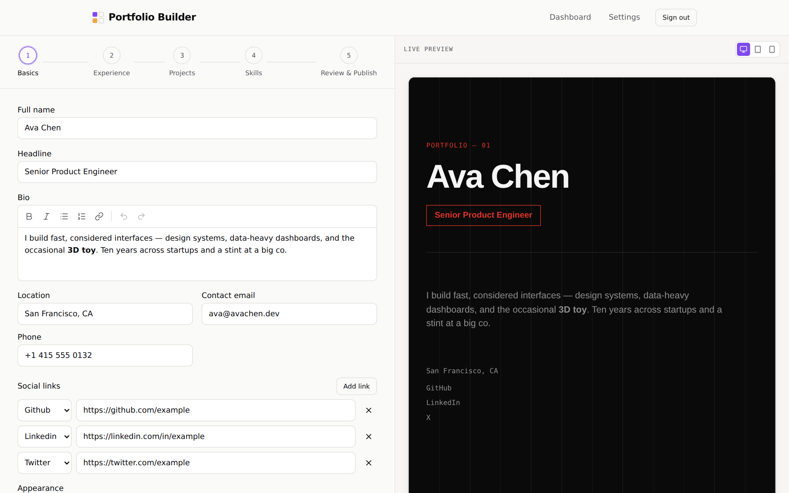

# Portfolio Builder — API

Hono on Bun. Auth, profile storage, template gallery, ZIP export, and
the hosting build/publish pipeline behind
[`portfolio-builder-ui`](https://github.com/darshan260802/portfolio-ui).

<p align="center">
  
</p>

Runs one process. Every request routes through Hono, sessions come from
Better Auth (Prisma adapter, cross-subdomain cookies), the build queue
is in-process, and published sites live behind an nginx that resolves
`<slug>.<domain>/` to a symlink this API owns.

---

## What it does

- **Serves the builder app** — templates, profile CRUD, slug lookup,
  auth (Google, GitHub, email + password with real reset flows via
  Resend).
- **Runs the build/publish pipeline** — takes one wizard's worth of
  data, spawns a real Vite build for the picked template, and atomically
  publishes the result at `<slug>.<domain>`.
- **Provides the ZIP export** — same materialized project the hosted
  build uses, streamed as an archive so the user gets a working Vite +
  React repo (no lock-in).
- **Enforces "one portfolio per account"** — publishing over an
  existing site is fine; asking for a *second* subdomain returns
  `409 site_exists` naming what the account already owns.

## Feature highlights

| Feature | What it does | Why it exists |
|---|---|---|
| **Materialize → Vite build → publish** | For every deploy, scaffolds a real Vite + React project (template source + user data.json + rewritten placeholders), hardlink-copies prewarmed `node_modules`, spawns Vite via `Bun.spawn` (never through a shell wrapper), and copies `dist/` into `.releases/<slug>/<deploymentId>/`. | Real Vite output means every build is production-quality; hardlink (`cp -al`) instead of symlink prevents Vite realpath from resolving React outside the build root. |
| **Atomic slug symlink** | Publishing writes a temp-named symlink and `rename(2)`s it over `PORTFOLIOS_DIR/<slug>`. Slug renames point the new name at the current release *before* the DB row moves, so there's never a 404 window. | Plain `ln -sfn` is unlink-then-symlink — leaves a real gap where the site 404s. |
| **Slug rename without rebuild** | Site URL is written to HTML as a `%%SITE_URL%%` placeholder; publish rewrites it. Renames only touch the placeholder and the symlink. | Renaming is instant; the build only happens on real content changes. |
| **Concurrency-capped build queue** | In-process queue caps concurrent builds (`MAX_CONCURRENT_BUILDS`), enforces `BUILD_TIMEOUT_MS`, and SIGKILLs on timeout. Orphaned `BUILDING` deployments are reaped on boot. | One process = simple ops; the cap keeps a burst of deploys from starving the machine. |
| **Rich-text sanitization at the boundary** | `PUT /api/me/profile` sanitizes `profile.bio`, `experience.summary`, and `project.description` with a strict allowlist (bold, italic, links, two list types) before persisting. | Every downstream reader (live preview, ZIP export, hosted build) can trust what's already in the database. |
| **Uploads validated on the bytes** | `POST /api/uploads/:kind` (profile photo, résumé) takes the file through the API instead of handing out a signed URL, caps it at 5 MB, and decides the format by sniffing magic bytes — `%PDF-`, the PNG/JPEG/WebP headers, and for `.docx` the ZIP header **plus** a `word/document.xml` entry. The stored object's extension and content type come from what the bytes are, never from what the upload claimed. | A signed upload URL carries no size or type constraint, and a résumé is served to every visitor of a published portfolio — "the browser said it was a PDF" isn't a good enough answer for what it is. A renamed `.zip` passes a ZIP-header check; it doesn't pass this one. |
| **Superseded uploads collected on replace** | After a successful upload the API prunes the account's older objects of that kind, keeping the new one **and** whichever one the saved profile still points at. | The client hasn't written the new URL yet at that moment. Deleting the still-referenced object would leave anyone who closes the tab mid-edit with a portfolio pointing at a 404. |
| **Cross-subdomain sessions** | Better Auth `crossSubDomainCookies` + explicit `Access-Control-Allow-Credentials`. | The builder at `app.<domain>` and every user site at `<slug>.<domain>` share the same auth story cleanly. |
| **Single-portfolio guard** | `Site.userId` is unique; `POST /api/deploy` rejects a mismatched `slug` with `409 site_exists` instead of silently overwriting. | Aligns the API with the UI's overwrite confirm — no more silent "publish → surprise, my other site is gone". |

## Who it's for

- Anyone hosting the whole Portfolio Builder stack.
- People curious about a real build-and-publish pipeline that avoids
  the usual footguns — Bun spawn semantics, React realpath resolution,
  atomic publishing, symlink races.

## What it looks like (from the user's side)

<table>
  <tr>
    <td width="50%">
      
      <p align="center"><em>The wizard writes to <code>PUT /api/me/profile</code> every step; every rich-text field is sanitized here.</em></p>
    </td>
    <td width="50%">
      
      <p align="center"><em>Settings actions each go through this API — rename (<code>PATCH /me/site/slug</code>), redeploy (<code>POST /deploy</code>).</em></p>
    </td>
  </tr>
</table>

---

## Setup

```sh
bun install
cp .env.example .env   # fill in real values
bunx --bun prisma generate
bunx --bun prisma migrate dev   # against DIRECT_URL, see prisma.config.ts
bun run dev
```

`@pb/templates` ships as a `github:` dependency from
[`portfolio-templates`](https://github.com/darshan260802/portfolio-templates)
with its `dist/` committed, so `bun install` doesn't run a build.

`TEMPLATES_DIR` must point at a checkout of `portfolio-templates` where
`bun run build && bun run prewarm` have already run — the build pipeline
reads template source and prewarmed `node_modules` straight off disk,
not through the npm-style package install.

## Environment

Full list in `.env.example`. The ones you can't skip:

| Var | What it is |
|---|---|
| `DATABASE_URL` | Supavisor **transaction pooler** (port 6543, `?pgbouncer=true&connection_limit=1`). Used at runtime. |
| `DIRECT_URL` | Direct Postgres (port 5432). Used only by `prisma migrate`. |
| `BETTER_AUTH_SECRET` / `BETTER_AUTH_URL` | Auth signing + canonical URL. |
| `GOOGLE_CLIENT_ID` / `GOOGLE_CLIENT_SECRET` / `GITHUB_CLIENT_ID` / `GITHUB_CLIENT_SECRET` | OAuth. |
| `RESEND_API_KEY` / `EMAIL_FROM` | Password reset emails. `env.ts` refuses `@resend.dev` in `NODE_ENV=production` — that shared sender only delivers to the Resend account owner. |
| `SUPABASE_URL` / `SUPABASE_SERVICE_ROLE_KEY` / `SUPABASE_BUCKET` | Signed upload URLs for user avatars/project images. |
| `TEMPLATES_DIR` / `PORTFOLIOS_DIR` / `BUILD_TMP_DIR` | Absolute paths; see below. |
| `PORTFOLIO_DOMAIN` | e.g. `ourapp.com`. Sites publish at `<slug>.<PORTFOLIO_DOMAIN>`. |
| `WEB_ORIGIN` / `COOKIE_DOMAIN` | For CORS + cross-subdomain cookies. |

## Prisma 7 notes

Uses the `prisma-client` generator (TS query compiler, no Rust engine
binary) with `@prisma/adapter-pg`. Connection config is split two ways:

- **Runtime** (`src/lib/prisma.ts`): `PrismaPg` adapter against
  `DATABASE_URL` — the Supavisor **transaction pooler**.
- **CLI** (`prisma.config.ts`, used by `generate`/`migrate`/`studio`):
  `DIRECT_URL` — direct Postgres (port 5432). Migrations need a real
  session, not a transaction-mode pooler.

`schema.prisma`'s `datasource` block intentionally has no
`url`/`directUrl` — Prisma 7 removed those in favor of
`prisma.config.ts`.

## Build/publish pipeline

`POST /api/deploy` queues a `Deployment` row
(`src/services/queue.service.ts`, concurrency-capped in-process). Each
job (`src/services/builder.service.ts`):

1. Materializes a real Vite project (`scaffold.service.ts`): scaffold
   shell + this template's source + `data.json`. It also copies the
   templates repo's `src/rich-text.tsx`, `src/uploads.ts` and
   `src/schema.ts` — every template's sections import runtime values from
   the first two (`RichText`, `resumeDownload`), so leaving either out
   fails the build on an unresolved import rather than degrading.
2. Downloads any Supabase Storage assets referenced in the data into
   `public/assets/` (`assets.service.ts`) so the output is
   self-contained.
3. Hardlink-copies (`cp -al`) that template's prewarmed `node_modules`
   in — never symlinked; Vite realpaths through symlinks by default,
   which can resolve React outside the build root.
4. Spawns the Vite binary directly via `Bun.spawn` (never `bun x`/`bun
   run` — a shell wrapper survives SIGTERM and orphans the real build).
   SIGKILL on timeout because SIGTERM may not stop a wedged native
   Rolldown thread.
5. Publishes (`hosting.service.ts`): copies `dist/` into
   `.releases/<slug>/<deploymentId>/`, rewrites the `%%SITE_URL%%`
   placeholder left in the HTML by the build, then atomically repoints
   the `PORTFOLIOS_DIR/<slug>` symlink at it (symlink-to-temp-name +
   `rename()` — plain `ln -sfn` is not atomic).

A slug rename only ever touches the publish step (the placeholder
rewrite), never a rebuild.

## Routes

| Method + path | Auth | Purpose |
|---|---|---|
| `GET /api/templates` | public | Lists template manifests from `@pb/templates`. |
| `GET /api/me/profile` | ✓ | Reads the account's profile (`{ templateId, data, updatedAt }`). |
| `PUT /api/me/profile` | ✓ | Replaces the profile. Zod-validated with the shared schema; rich-text sanitized. |
| `GET /api/me/site` | ✓ | Current site (slug, template, status, url). |
| `POST /api/deploy` | ✓ | Queues a build. Rejects a second subdomain (`409 site_exists`). |
| `GET /api/deployments/:id` | ✓ | Poll for status/log. |
| `PATCH /api/me/site/slug` | ✓ | Rename. Two-phase symlink swap when live. |
| `GET /api/slug/check?slug=…` | public | Availability + reason code. |
| `POST /api/uploads` | ✓ | Signed Supabase upload URL scoped to the user. Project images only. |
| `POST /api/uploads/:kind` | ✓ | `avatar` \| `resume`. Multipart (`file`), validated and stored server-side; returns `{ url, filename, contentType, size }`. |
| `DELETE /api/uploads/:kind` | ✓ | Removes the account's stored files of that kind. Call it *after* saving the cleared profile. |
| `POST /api/export/zip` | ✓ | Streams a ZIP of the materialized project. |
| `POST /api/auth/**` | — | Better Auth handler. |

## Nginx

```nginx
# App and API (both terminated here in production)
server {
  server_name app.example.com;
  location / { proxy_pass http://127.0.0.1:5173; }  # or served static
}
server {
  server_name api.example.com;
  location / { proxy_pass http://127.0.0.1:3000; }
}

# Every hosted portfolio (wildcard) — nginx just resolves
# PORTFOLIOS_DIR/<slug> which is a symlink this API owns.
server {
  server_name ~^(?<slug>[a-z0-9][a-z0-9-]*)\.example\.com$;
  root /var/portfolios;
  location / { try_files /$slug$uri /$slug$uri/ /$slug/index.html =404; }
}
```

## Known gaps

### The `@pb/templates` pin is unresolved on purpose

`bun.lock` carries no entry for `@pb/templates`. The résumé/photo work
needs the templates commit that adds `src/uploads.ts`, and this
environment cannot reach GitHub's tarball API
(`api.github.com/repos/.../tarball/...` → 403 from the egress proxy;
`codeload.github.com` is fine but produces different bytes, so a valid
integrity hash can't be derived from it either).

Leaving the old entry in place would have been worse than removing it: a
plain `bun install` keeps a locked commit for a `#branch` specifier, so
it would have quietly reinstalled a `@pb/templates` without `uploads.ts`
and broken the build with a confusing missing-export error. With no
entry, `bun install` re-resolves `#master` and writes a correct one, and
`--frozen-lockfile` fails loudly instead of installing the wrong thing.

**Run `bun install` once from an environment with GitHub API access and
commit the regenerated `bun.lock`.** Everything else here was verified
against the real package contents, vendored into `node_modules` from a
checkout of the merged templates commit.

### Server boot

Full server boot (Better Auth + Prisma against a live Postgres) has not
been exercised in this environment — there's no local Postgres available
here. Everything up to that boundary is verified: the module graph
type-checks cleanly end to end, and the build → publish → rename →
unpublish pipeline was run for real against the templates repo's Aurora
template. Point `DATABASE_URL`/`DIRECT_URL` at a real (or local)
Postgres and run `prisma migrate dev` before the first `bun run dev`.
